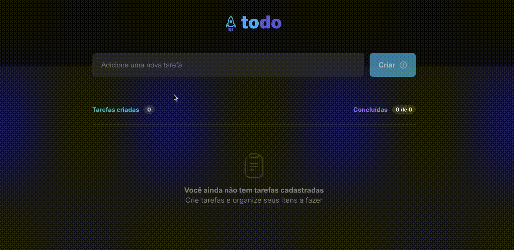

<h1 align="center">
    To Do ReactJS with TypeScript
</h1>

<h2 align="center">
    A Rocketseat Ignite project :rocket:
</h2>

  
   
  
   
    

  <a href="#rocket-technologies">Technologies</a>&nbsp;&nbsp;&nbsp;|&nbsp;&nbsp;&nbsp;
    <a href="https://to-do-react-coral.vercel.app/" target="_blank">Live demo</a>&nbsp;&nbsp;&nbsp;

## :rocket: Technologies

- [ReactJS](https://reactjs.org/)
- [ViteJS](https://vitejs.dev/)
- [TypeScript](https://www.typescriptlang.org/)

Made with ♥ by Carlos :wave: [Get in touch!](https://www.linkedin.com/in/kdumagalhaes/)
